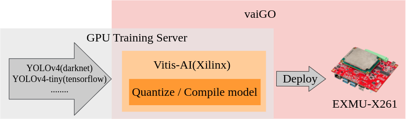
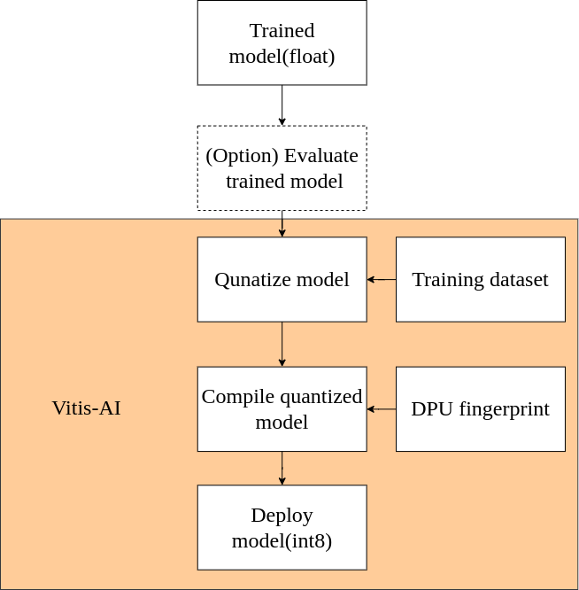

# Vitis-AI GO
- [See What's New](#see-whats-new)
- [Introduction](#introduction)
- [Matters Needing Attention](#matters-needing-attention)
- [Currently Support](#currently-support)
- [Minimum requirement](#minimum-requirement)
    - [Host requirement](#host-requirement)
  - [We use the following GPU and Vitis-AI version to test our convert flow.](#we-use-the-following-gpu-and-vitis-ai-version-to-test-our-convert-flow)
    - [Vitis-AI 1.4](#vitis-ai-14)
    - [Vitis-AI 2.5](#vitis-ai-25)
- [Models we have tested](#models-we-have-tested)
- [Getting Started](#getting-started)
- [Reference](#reference)
- [Contributor](#contributor)

# See What's New
  - [Release Notes](doc/release_notes.md)
  - **Features**
    - Add arch.json and auto check txt rows.
    - Add copy q.py in script. 
  - **Fix**
    - Fix tf2_compiler.sh 
    - Delete example folder.
    - Lprnet usage.
  - **Docs**
    - update usage
    - add some result images.

# Introduction
This repository is based on [Xilinx Vitis-AI](https://www.xilinx.com/products/design-tools/vitis/vitis-ai.html). To provide a way better to use [Vitis-AI](https://github.com/Xilinx/Vitis-AI) for AI model converter on FPGA. This repository We integrated Vitis-AI xmodel compile flow and evaluative method in our GO.

Like the following shows, the trained model can be quantize and compile to xmodel. And also deploy on FPGA.

 

 

The following chart shows the Vitis-AI Model converting flow. To evaluate model can avoid the model spawned some problems during quantize model or compile model. But evaluate model step is optional which means you can choose whether you want to evaluate model. 

 

 

# Matters Needing Attention
1. `Please select the correct version before download the Vitis-AI github. The version is depended on library of the FPGA system.`  
   - How the check VAI version reference in FAQ [How to check the VAI version and fingerprint on FPGA?](./doc/topics/5.FAQ/FAQ.md#8-how-to-check-the-vai-version-and-fingerprint-on-fpga)
2. `In compiling model step, the fingerprint which depended on the VAI version and channel parallelism in DPU IP on the FPGA.`  
   - How the check DPU IP infromation reference in FAQ [How to check the VAI version and fingerprint on FPGA?](./doc/topics/5.FAQ/FAQ.md#8-how-to-check-the-vai-vesrion-and-fingerprint-on-fpga)
3. `Make sure all of your actions were executed in the continer of Vitis-AI because the OS-ENV is different.`

# Currently Support
> Note: Caffe has been deprecated from Vitis-AI 2.5(See also. [Vitis-AI user guide](https://docs.xilinx.com/r/en-US/ug1414-vitis-ai/Vitis-AI-Model-Zoo)). So we won't support caffe in GO. 

**Support framework depend on Vitis-AI container.**
- Tensorflow1
- Tensorflow2
- PyTorch

**Support Dataset format**
> Note: Dataset including training and validation (At least 50 images for each). And make sure the training dataset folder is in the `Vitis-AI folder`.
- png

**Support trained model framework**
  - Tensorflow
  - PyTorch
  - Darknet
# Minimum requirement
### Host requirement
 - Ubuntu 18.04
 - Python3, at least 3.5
 - Intel Core i5-12400
 - RAM, at least 32GB
 
## We use the following GPU and Vitis-AI version to test our convert flow. 
### Vitis-AI 1.4
  - Tesla - T4 16GB or RTX2070 super 12GB
  - Nvidia driver version 470.103.01
  - CUDA Version 10.x
   
### Vitis-AI 2.5 
  - RTX3080 12GB
  - Nvidia driver version 470.141.03   
  - CUDA Version: 11.x 

# Models we have tested
> Note: We ensure the following models can be quantized and compiled successfully. Some model might be failed during quantizatoion and compilation. Please check Xilinx supported Operations list.(See also. [Supported Operations and APIs in Vitis-AI user guide](https://docs.xilinx.com/r/en-US/ug1414-vitis-ai/Vitis-AI-Overview)).   

`Tensorflow1` 
  - YOLOv3-tiny
  - YOLOv4
  - YOLOv4-tiny

`Tensorflow2`
  - YOLO4-tiny 
  - CNN 
  - InceptionNet

`PyTorch`
  - LPRNet

# Getting Started
- [Getting Started](./doc/topics/0.Getting_Started/getting_started.md)
- [Tensorflow1](./doc/topics/1.Tensorflow1/)
  - [Object Detection](./doc/topics/1.Tensorflow1/Object_Detection/)
    - [Example-YOLOv4](./doc/topics/1.Tensorflow1/Object_Detection/Example_YOLOv4.md)
- [Tensorflow2](./doc/topics/2.Tensorflow2/)
  - [Object Detection](./doc/topics/2.Tensorflow2/Object_Detection/)
    - [Example-YOLOv4-tiny](./doc/topics/2.Tensorflow2/Object_Detection/Example-YOLOv4-tiny.md)
  - [Classification](./doc/topics/2.Tensorflow2/Classification/)
    - [Example-Inceptionv1](./doc/topics/2.Tensorflow2/Classification/Example_Inceptionv1.md)
- [PyTorch](./doc/topics/3.Pytorch)
  - [LPRNet](./doc/topics/3.Pytorch/LPRNet/Example_LPRNet.md)
- [Evaluation](./doc/topics/4.Evaluation/)
  - [Object Detection](./doc/topics/4.Evaluation/Object_Detection/)
    - [Evaluate-YOLOv4-tiny](./doc/topics/4.Evaluation/Object_Detection/Evaluate_YOLOv4-tiny.md)
- [FAQ](./doc/topics/5.FAQ/FAQ.md)

# Reference
 - Vitis-AI Tutorials to convert models: https://github.com/Xilinx/Vitis-AI-Tutorials
 - To convert to TensorFlow, we refer the repository:
   - david8862's keras-YOLOv3-model-set: https://github.com/david8862/keras-YOLOv3-model-set
 - To train yolov4-tiny, we refer the repository:
   - yss9701's Ultra96-Yolov4-tiny-and-Yolo-Fastest: https://github.com/yss9701/Ultra96-Yolov4-tiny-and-Yolo-Fastest
- Vitis-AI 1.4 user guide: https://docs.xilinx.com/r/1.4.1-English/ug1414-vitis-ai
- Vitis-AI 2.5 user guide: https://docs.xilinx.com/r/2.5-English/ug1414-vitis-ai
- txt2xml: https://zhuanlan.zhihu.com/p/391137600

# Contributor

Author | E-mail | Corp.|
|:---:|:---:|:---:|
|Allen.H|allen_huang@innodisk.com|innodisk Inc|
|Hueiru|hueiru_chen@inndisk.com|innodisk Inc|
|Wilson|wilson_yeh@innodisk.com|innodisk Inc|
|Jack|juihung_weng@innodisk.com|innodisk Inc|
