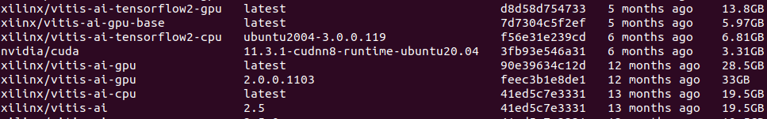
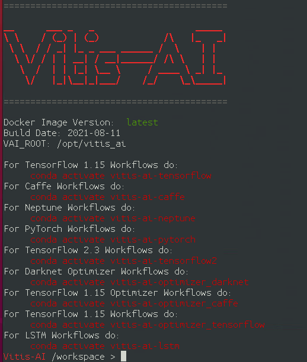

- [Getting Started](#getting-started)
- [Next Steps](#next-steps)

# Getting Started
Before starting to convert the model, must take care of the following points.

1. Prepare an X86 platform with GPU. 
   - We recommend using a Linux system as it is easier to set up the environment and perform subsequent operations. For detailed suggestions, please refer to the [Minimum requirement](../../../README.md#minimum-requirement).

2. Clone the Vitis-AI verion, which is going to use.
   - The following command would download the newest Vitis-AI version.
      ```
      git clone https://github.com/Xilinx/Vitis-AI.git
      ```
   - If you need an other version, please go to the Vitis-AI GitHub page to check for the tag version and use the following command to download it.
      ```
       git clone https://github.com/Xilinx/Vitis-AI.git -b <branchname>
      ```
   > Note: Please double-check that the version of Vitis-AI being used is compatible with the version on the FPGA.

2. Install the Vitis-AI docker on X86.
   - Please refer to the [Vitis-AI](https://github.com/Xilinx/Vitis-AI) for how to install Docker and build docker image.

4. Clone [vaiGO](https://github.com/InnoIPA/vaiGO.git).
   ```
   git clone https://github.com/InnoIPA/vaiGO.git
   ```
5. Please copy the `vitis_docker_run.sh`  to the parent directory of the vaiGO path.
   ```
   cd vaiGO
   cp ./vitis_docker_run.sh ../
   ```
   
   The folder structure is as follows
   
   ```
      .
      ├── vaiGO
      └── vitis_docker_run.sh
   ```

   > Note: This is a simple script to help you quickly enter the Vitis-AI container, or you can use the official script(`docker_run.sh`) provided.

6. Execute script to boot Vitis-AI continer. Welcome message as below figure. You will see the as following.

   1. Check Vitis-AI image ID.
 
      ```
      docker image ls
      ```
      <div align="center"></div>
      <br />

   2. Use docker image ID to boot Vitis-AI container.
   
      Usage
      ```
         ./vitis_docker_run.sh <image id>
      ```
      Example
      ```
         ./vitis_docker_run.sh 7d7304c5f2ef
      ```
      <div align="center"></div>
      <br />
# Next Steps
You can convert models according to the AI framework you are using.
- [Tensorflow1](../1.Tensorflow1/)
- [Tensorflow2](../2.Tensorflow2/)
- [Pytorch](../3.Pytorch/)