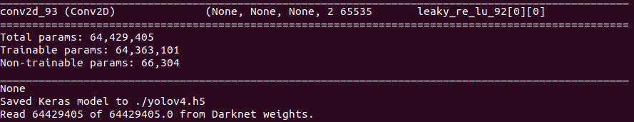

# Example - YOLOv4
In this section, you will learn how to convert a trained model to xmodel in a Tensorflow 1 container. Also, We have confirmed that this flow also applies to the following models.
 - YOLOv4 and v4-tiny
 - YOLOv3 and v3-tiny
  
> Note: Dataset including training and validation (At least 50 images for each). And make sure the training dataset folder is in the `vaiGO folder`.

# Conversion Flow
## Boot Vitis-AI container

1. Use docker image ID to boot Vitis-AI container.
   
   Usage
   ```
      ./vitis_docker_run.sh <image id>
   ```
   Example
   ```
      ./vitis_docker_run.sh 7d7304c5f2ef
   ```
2. Activate conda env.
   ```
   conda activate vitis-ai-tensorflow
   ```
   <div align="center"></div>
   <br />

3. Go to `model2xmodel_package` folder.
   ```
    cd vaiGO/model2xmodel_package
   ```

## Prepare the File to be Converted.
1. Create a folder and go to the folder

   Be sure your current working directory is in <case_folder_name> after this step.
   ```
   mkdir <case_folder_name>
   
   cd <case_folder_name>
   ```
2. Create training datasets path. There will be a file containing the path to the dataset.
   ```
   python ../common/splitdata.py <training datasets folder path> -r 1
   ```
   
   <div align="center"></div>
   <br />

   <div align="center"></div>
   <br />


## Convert the Trained Model to .pb That Can be Used by Tensorflow 1.
To convert the trained model to model.pb. There are several formats for trained models,please convert the model according to the trained model format.
   
   Convert `model.h5` and `model_config.json` to `.pb`. 
   1. Please put the `model.h5` and `model_config.json` into <case_folder_name>.

      Usage:
      > python ../common/keras-YOLOv3-model-set/tools/model_converter/keras_to_tensorflow.py \
        --input_model=<model.h5> \
        --input_model_json=<model_config.json> \
        --output_model=<output.pb> 
      
      Example:
      ``` 
      python ../common/keras-YOLOv3-model-set/tools/model_converter/keras_to_tensorflow.py --input_model=model.h5 --input_model_json=model_config.json --output_model=output.pb
      ```
      Example for tensorflow yolov4-tiny
      <div align="center"></div>
      <br />

   Convert `model.weight` and `model.config` to `.pb`.

   1. Please put the `model.weight` and `model.config` into <case_folder_name>.
      > Note: The conversion of the Darknet YOLOv4 can be quite effective.
      
      1. Change `model.weight` and `model.config` to `.h5` first.
         
         Usage:
         > python ../common/keras-YOLOv3-model-set/tools/model_converter/convert.py \
         --yolo4_reorder <model.cfg> <model.weights> <output.h5>
   
         Example:
         ``` 
         python ../common/keras-YOLOv3-model-set/tools/model_converter/convert.py --yolo4_reorder ./yolov4.cfg ./yolov4-best.weights ./yolov4.h5
         ```
         Example for Darknet YOLOv4 
         <div align="center"></div>
         <br />
      
      2. Change `model.h5` to `.pb`.

         Usage:
         > python ../common/keras-YOLOv3-model-set/tools/model_converter/keras_to_tensorflow.py \
          --input_model <output.h5> \
          --output_model=<output.pb>

         Example:
         ``` 
         python ../common/keras-YOLOv3-model-set/tools/model_converter/keras_to_tensorflow.py --input_model ./yolov4.h5 --output_model=output.pb
         ```
         
         Example for Darknet YOLOv4 
         <div align="center"></div>
         <br />

## Quantize the Model and Convert Model to xmodel
1. Quantize model using following command.

      Usage:
      > quantize_yolov4.sh  <model_input_size> <model_input_channel> <input_node_name> <output_node_name>

      Example: 
      ```
      ../common/quantize_yolov4.sh 320 3 input_1 conv2d_20/BiasAdd,conv2d_23/BiasAdd
      ``` 
   
      <div align="center"></div>
      <br />
      
      Note: 
      > You may encounter some problems while running above command if it rapid done.  
      > If so, you can check `input node name` and `output node name` of your model(pb file) on [netron]( https://netron.app/). The figure shows model's (yolov4-tiny.pb) node name as below.

      Input node name:
      <br />
      <div align="center"></div>

      <br />

      Output node name:
      <br />
      <div align="center"></div>

      <br />


2.  Convert quantize model to xmodel.

      Usage:      
      > xmodel.sh <model_input_size> <model_input_channel> <arch.json_file> <output_name>

      Example:
      ```    
      ../common/xmodel.sh 320 3 ../common/k26_arch.json dpu-xmodel
      ```

      Note:
      > Make sure the data of fingerprint(k26_arch.json) matched the DPU model on PL and the Vitis-AI version. 
      
      <br />
      <div align="center"></div>
      <br />
