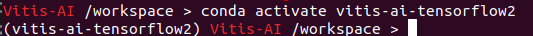

# Example - Inceptionv1
In this section, you will learn how to convert a trained model to xmodel in a Tensorflow 2 container.


> Note: Dataset including training and validation (At least 50 images for each). And make sure the training dataset folder is in the `vaiGO folder`.

# Conversion Flow
## Boot Vitis-AI container
1. Use docker image ID to boot Vitis-AI container.
   
   Usage
   ```
      ./vitis_docker_run.sh <image id>
   ```
   Example
   ```
      ./vitis_docker_run.sh 7d7304c5f2ef
   ```

2. Activate conda env. for Tensorflow2.
   ```
   conda activate vitis-ai-Tensorflow2
   ```
   <div align="center"></div>
   <br />

3. Go to `model2xmodel_package` folder.
   ```
    cd vaiGO/model2xmodel_package
   ```
## Prepare the File to be Converted
1. Create a folder and go to the folder

   Be sure your current working directory is in <case_folder_name> after this step.
   ```
   mkdir <case_folder_name>
   
   cd <case_folder_name>
   ```
2. Put the train and val dataste together. And set dataset folder like following show.

   ```
   └── train_and_val
       ├── class1
       ├── class2
       ├── class3
       └── class4
            .
            .
            .
   ```
3. Add a file named `classes.txt`.
   ```
   class1
   class2
   class3
   class4
   ```

4.  Package dataset to `.tfrecord` according to the number of datasets.
      Usage:
      > python3 ../common/image_to_tfrec.py -d dataset_path -n tfrecord name -n classification
      

      Example: 
      ```
      python3 ../common/image_to_tfrec.py -d ./train_and_val/  -n quantize -f class
      ```
      Result:
      ```
      quantize_0.tfrecord
      quantize_1.tfrecord
            .
            .
            .
      ```
## Quantize the Model and Convert Model to xmodel

1. Quantize model
   
   Usage:
      > ../common/tf2_quantize.py -m <model path> <model_config.json>

   Example:
   ```
   python3 ../common/tf2_quantize.py -m ./ep2494-loss4.648-val_loss4.691.h5 model_config.json
   ```
   
   <div align="center"></div>
   <br />

2. Compile quantize model to xmodel
   Usage:      
      > xmodel.sh <arch.json_file>
   
   Example
   ```
      ../common/tf2_compile.sh ../common/k26_v25_arch_3136.json
   ```
   Note:
   > Make sure the data of fingerprint(k26_arch.json) matched the DPU model on PL and the Vitis-AI version.
   
   <div align="center"></div>
   <br />