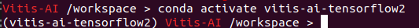
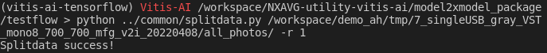
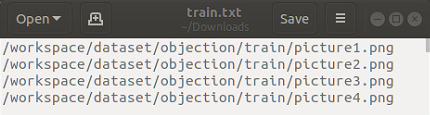
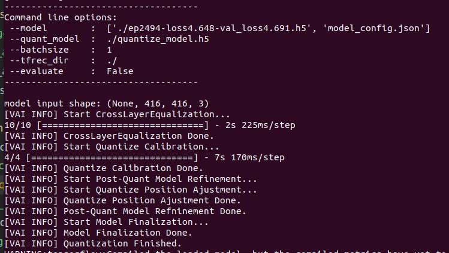
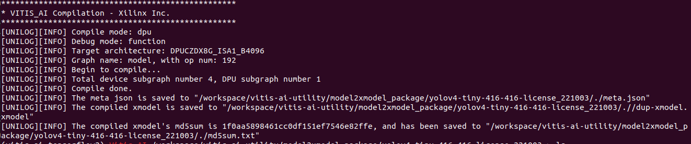
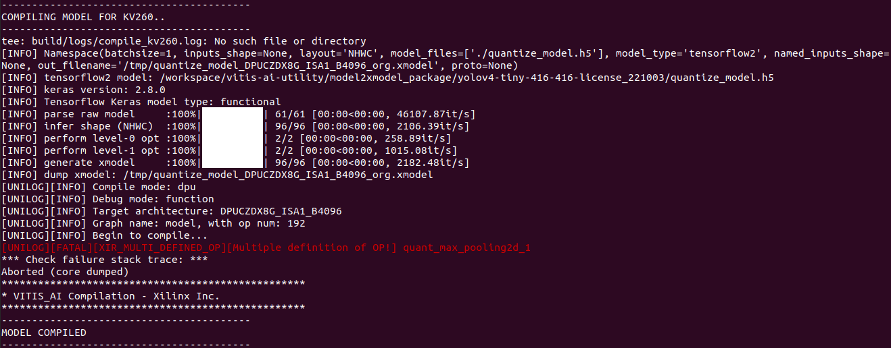

# Example - YOLOv4-tiny
In this section, you will learn how to convert a trained model to xmodel in a Tensorflow 2 container. Also, We have confirmed that this flow also applies to the following models.
 - YOLOv4 and v4-tiny
 - YOLOv3 and v3-tiny

> Note: Dataset including training and validation (At least 50 images for each). And make sure the training dataset folder is in the `vaiGO folder`.

# Conversion Flow
## Boot Vitis-AI container
1. Use docker image ID to boot Vitis-AI container.
   
   Usage
   ```
      ./vitis_docker_run.sh <image id>
   ```
   Example
   ```
      ./vitis_docker_run.sh 7d7304c5f2ef
   ```
2. Activate conda env. for Tensorflow2.
   ```
   conda activate vitis-ai-Tensorflow2
   ```
   <div align="center"></div>
   <br />

3. Go to `model2xmodel_package` folder.
   ```
    cd vaiGO/model2xmodel_package
   ```
## Prepare the File to be Converted
1. Create a folder and go to the folder

   Be sure your current working directory is in <case_folder_name> after this step.
   ```
   mkdir <case_folder_name>
   
   cd <case_folder_name>
   ```

2. Create training datasets path.There will be a file containing the path to the dataset.
   ```
   python ../common/splitdata.py <training datasets folder path> -r 1
   ```
   
   <div align="center"></div>
   <br />

   <div align="center"></div>
   <br />

3. Change label format from .txt to .xml
   > This step is not necessary if you don't use XML.

         Usage:
         $ IMAGE_SOURCE=<datasets_path>  
         $ python ../common/txt2xml.py \
            -img $IMAGE_SOURCE \
            -txt $IMAGE_SOURCE \
            -xml $IMAGE_SOURCE

         Example:
            $ IMAGE_SOURCE=/workspace/demo_ah/tmp/7_singleUSB_gray_VST_mono8_700_700_mfg_v2i_20220408/u7_testing_data/220406_test_frame2image/

            $ python ../common/txt2xml.py -img $IMAGE_SOURCE -txt $IMAGE_SOURCE -xml $IMAGE_SOURCE
   <!-- <div align="center"></div>
   <br /> -->

4. Parse your dataset.

   ```
   python ../common/parser_dataset.py 
   ```
   <!-- <div align="center"></div>
   <br /> -->

5. Pakage dataset to `.tfrecord`.
   Usage:
   > ../common/image_to_tfrec.py -d <dataset path>  -n quantize -f obj

   Example: 
   ```
   python3 ../common/image_to_tfrec.py -d ./parser_image_list.txt -n quantize -f obj
   ```
   
   Result:
   ```
   quantize_0.tfrecord
   quantize_1.tfrecord
         .
         .
         .
   ```

## Quantize the Model and Convert Model to xmodel
1. Quantize model
   
   Usage:
      > ../common/tf2_quantize.py -m <model path> <model_config.json>

   Example:
   ```
   python3 ../common/tf2_quantize.py -m ./ep2494-loss4.648-val_loss4.691.h5 model_config.json
   ```
   
   <div align="center"></div>
   <br />

2. Compile quantized model to xmodel.
   
   Usage:      
      > xmodel.sh <arch.json_file>
   
   Example
   ```
      ../common/tf2_compile.sh ../common/k26_v25_arch_3136.json
   ```
   Note:
   > Make sure the data of fingerprint(k26_arch.json) matched the DPU model on PL and the Vitis-AI version.
   <br />
   <div align="center"></div>
  
## FAQ
1. Failed to compile the quantized model to xmodel failed as following shows in Vitis-AI 2.5?
   <br />
   <div align="center"></div>
   <br />

   1. Copy xmodel to the folder where dumped path as above figure
      > [INFO] dump xmodel: <...>
         ```
         cp /tmp/quantize_model_DPUCZDX8G_ISA1_B4096_org.xmodel ./quantize_model.xmodel
         ```  

   2. Exectue tf2_tmp_chagne_layer.py
      ```
      python3 ../common/tf2_tmp_chagne_layer.py
      ```
      Note: 
      > This is a temporary workaround and will be fixed in future vitis-ai 3.0.  

   3.  Change env to conda pytroch and compile model again.
         ```
         ../common/pytorch_compile.sh ../common/k26_arch.json dup-xmodel
         ```    
         <br />
         <div align="center"></div>
         <br />

