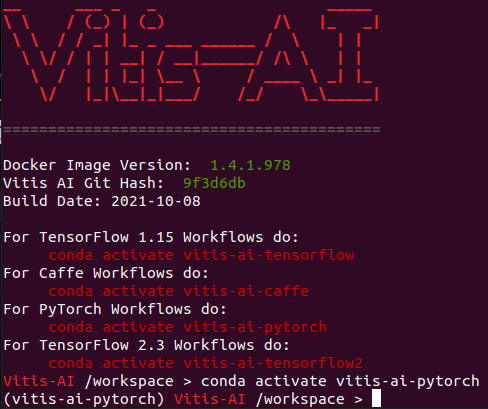
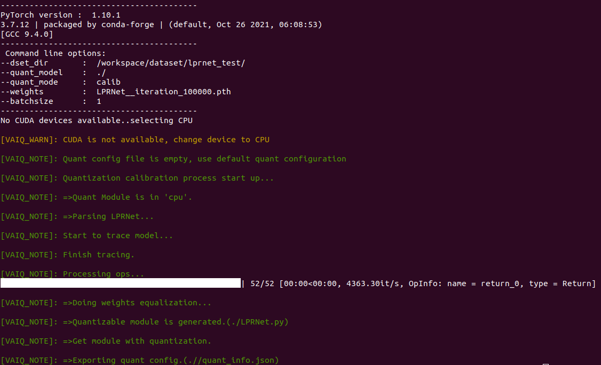
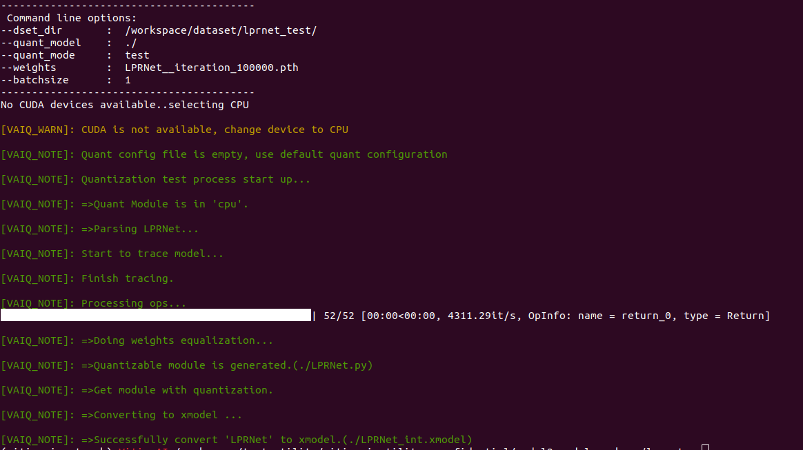
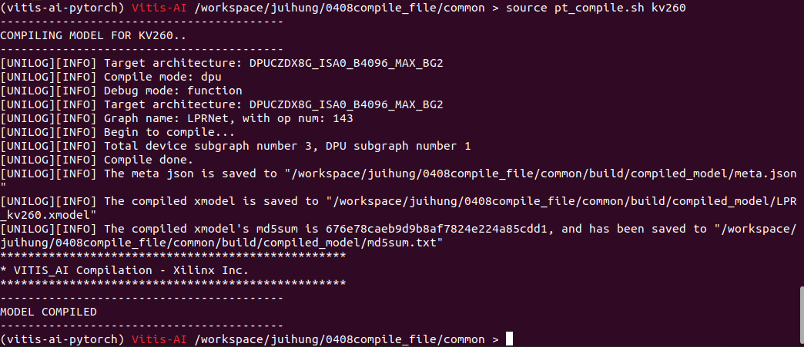

# Example - LPRNet
In this section, you will learn how to convert a trained model to xmodel in a Pytorch container. Also, We have confirmed that this flow also applies to the following models.
 - LPRNet

> Note: Dataset including training and validation (At least 200 images,and make sure the diversity of English letters). And make sure the training dataset folder is in the `vaiGO folder`.

# Conversion Flow
## Boot Vitis-AI container
1. Use docker image ID to boot Vitis-AI container.
   
   Usage
   ```
      ./vitis_docker_run.sh <image id>
   ```
   Example
   ```
      ./vitis_docker_run.sh 7d7304c5f2ef
   ```
2. Activate conda env for PyTorch.
   ```
   conda activate vitis-ai-pytorch
   ```
   <div align="center"></div>
   <br />

3. Go to `model2xmodel_package` folder.
   ```
   cd vaiGO/model2xmodel_package/
   ```
## Prepare the File to be Converted
1. Create a folder and go to the folder

   ```
   mkdir <case_folder_name>
   
   cd <case_folder_name>
   ```
2. Put your `weight.pt` into folder `<case_folder_name>` 

## Quantize the Model and Convert Model to xmodel

   1. In the pytorch convert flow, two steps are required to get a quantized model.
      
      1. Calib mode can export quantize config.
      
         Usage:

         > python3 ../common/pt_quantize.py -d dataset_path -w weight.pt -q calib
      
         Example:

         ```
         python3 ../common/pt_quantize.py -d /workspace/dataset/lprnet_test/ -w LPRNet__iteration_100000.pth -q calib
         ```
         <div align="center"></div>
         <br />
      
      2. Test mode to get quantied xmodel.
     
         Usgae:
         
         > python3 ../common/pt_quantize.py -d dataset_path -w weight.pth -q test

         Example

         ```
         python3 ../common/pt_quantize.py -d /workspace/dataset/lprnet_test/ -w LPRNet__iteration_100000.pth -q test
         ```
      
         <div align="center"></div>
         <br />
      
      3. Now, you can get `LPRNet_int.xmodel` in `<case_folder_name>`

2. Compile quantized model to xmodel

   Usage:
   > ../common/pt_compile.sh <qunatize xmodel> <arch json path> <output model name>

   Example:
   ```
   ../common/pt_compile.sh ./LPRNet_int.xmodel ../common/k26_v25_arch_3136.json pt_depoly
   ```
   
   Note:
   > Make sure the data of fingerprint(k26_arch.json) matched the DPU model on PL and the Vitis-AI version.
   
   <br />
   <div align="center"></div>
