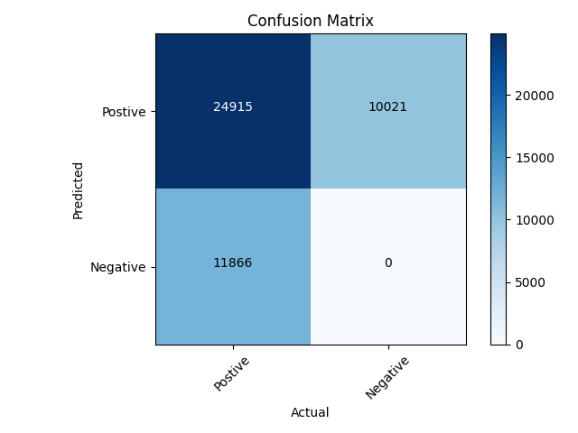

# Evaluate model's mAP
In this section, you will learn how to evaluate model's mAP in a Tensorflow 1 container. We used YOLOv4-tiny for example in this section.

<br />
<div align="center"></div>
<br />

If you want to validate each steps after converted the model. You should prepare for testing dataset first. And you must label your testing dataset for generating ground truth file.

Currently support:
- dataset format
   - png
- model
   - object detection - YOLO
- framework format
   - .h5 
   - .pb
   - .xmodel (Xilinx DPU IP)

Prerequisite:
   
   - yolo_anchores.txt 
   
   - classes.txt

   - Testing dataset (At least 50 pieces of images)

  1. Go to `predict_model_flow` folder.
      ``` 
      cd vaiGO/predict_model_flow
      ```
   
  2. Create a folder and go to the folder.
      ```
      mkdir <your_verify_output_folder>

      cd <your_verify_output_folder>
      ```

  3. Create testing datasets path.
      ```
      python ../../model2xmodel_package/common/splitdata.py <image_folder> -r 1
      ```
   
  4. To generate the ground true files. The following as below.
   
     1. Change label format from .txt to .xml
         > This step is not necessary if you don't use XML.

         Usage:
         >python ../txt2xml.py -img <path> 

         Example:
         ```
         python ../txt2xml.py -img /workspace/vaiGO/predict_model_flow/tmp_test_update/
         ```
         
         <div align="center"></div>
         <br />

     2. Parse your dataset.
      
         ```
         python ../parser_dataset.py 
         ```
         <div align="center"></div>
         <br />

     3. Generate the ground true file.
         ```
         python ../parser_list2gt_file.py -p parser_image_list.txt -c classes.txt
         ```

         <div align="center"></div>
         <br />

  5. Generate the result file.
      
      - Use .h5 to predict and get result file.
      
         Usage:
         > python ../h5_keras_predict.py\
          -t <datasets_path.txt> \
          -m <model.h5> \
          -s <input_size> \
          -a yolo_anchors.txt \
          -c classes.txt \
          -o <result_image_folder_path>

         Example: 
         ```
         python ../h5_keras_predict.py -t train.txt -m ../../model2xmodel_package/testflow/ep608-loss2.911-val_loss2.554.h5 -s 320 -a yolo_anchors.txt -c classes.txt -o h5_predict_output
         ```

         <div align="center"></div>
         <br />
     
      - Use .pb to predict and get result file.

         Usage:
         > python ../pb_tf_prediction.py\
          --pb_file <model.pb> \
          --test_list <datasets_path.txt>\
           -s <input_size> \
           -a <yolo_anchors.txt> \
           -c <classes.txt> \
           -o <result_image_folder_path>
         
         Example:
         > python ../pb_tf_prediction.py --pb_file ../../model2xmodel_package/testflow/output.pb --test_list train.txt -s 320 -a yolo_anchors.txt -c classes.txt -o pb_predict_output

         Note:
         > After quantize the model, you will get `quantize.pb`, also can use `pb_tf_prediction.py` to predict and get result file.

       - Use .xmodel (target device) to predict and get result file.
         
         Usage:
         > python ../xmodel_dpu_predict.py \
         -i <datasets_path.txt>\
         -x <framework> \
         -t <xmodel_predict_output>
         
         Example:
         ```
         python ../xmodel_dpu_predict.py -i train.txt -x yolo -t result_txt
         ```

         Note:
         > You must set config.json and run models on target device, before to generate the result.txt, you can refer to the [dpu-sc](https://github.com/InnoIPA/dpu-sc).


  6. Evaluate mAP
      
        Compare result.txt with gt_file to evaluate the mAP , draw PR Curve and draw Confusion Matrix.

        Usage:
        > python ../evaluation.py \
            -mode detection\
            -detection_use_07_metric True \
            -detection_metric map \
            -gt_file <ground_true.txt> \
            -result_file <models_predict_result.txt> \
            -detection_iou 0.45 \
            -detection_thresh <thresh_value> \
            -draw_pr True \
            -draw_cm True 

        Example:
        ```
        python ../evaluation.py -mode detection -detection_use_07_metric True  -gt_file gt_list.txt -result_file h5_result.txt -detection_iou 0.45 -detection_thresh 0.5 -draw_pr True -draw_cm True
        ```
      You will get the number of images, accuracy for each label and model's mAP. You can also get PR Curve and Confusion Matrix image in the folder.

      <div align="center"></div>
      <div align="center"></div>
      <br />
      <div align="center"></div>
      <br />
      <div align="center"></div>
      <br />