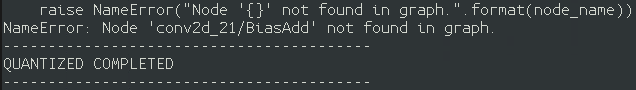
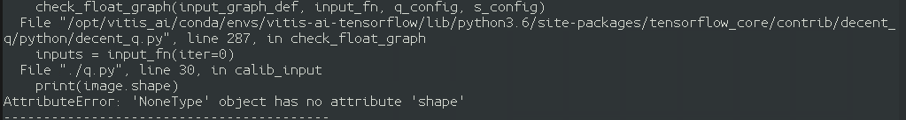
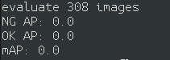
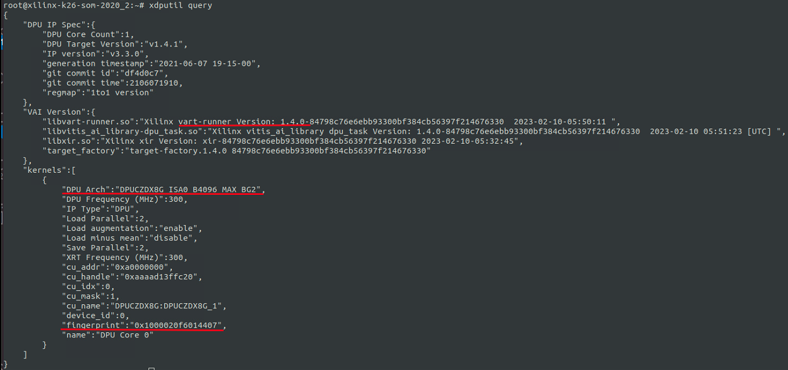
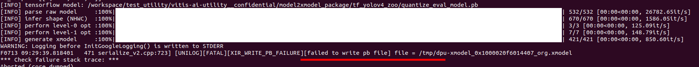
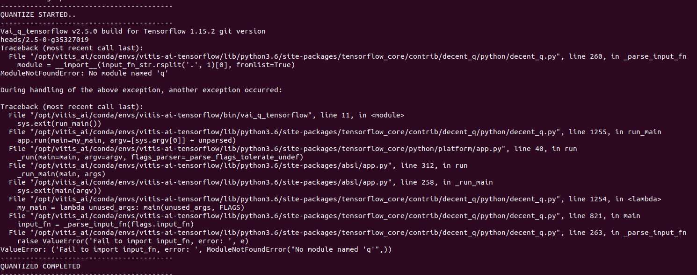

# FAQ

### 1. If possible use Tensorflow API to select another GPU on multi core platform while converting model?
   > Don't do this！！ it will get some error when your quantize model.

### 2. Why I got the no such file or directory message?
   > Please check your datasets or file is under the Vitis-AI folder. And must ensure you can see them when you activate conda in container.

### 3. While I am quantizing the model, I got NameError: Node 'xxxx' not found in graph?
   <div align="center"></div>
   
   > Please double check your model.pb's node name on [netron]( https://netron.app/).

### 4. While I am quantizing the model, I got AttributeError: 'NoneType' object has no attribute 'shape'?
   <div align="center"></div>

   > Please double check your datasets path in train.txt, which generate after `splitdata.py`.

### 5. After I converted model to xmodel successfully. While I was running xmodel on target device, I got input size error?
   > Please duble check when you quantized quantize.pb to xmodel, Your input size is the same as your model.

### 6. Why I can't validate model and get mAP: 0.0 while I am comparing result.txt and gt_file?
   <div align="center"></div>

   >  Please check you have run the command to "generate the ground true file".

### 7. If you have own model or want to deploy model to FPGA from GPU, may encounter some errors in Compiling stage.
   > Please refer `Supported Operators and DPU Limitations` in Vitis-AI DOC. It will be helpful for you.

### 8. How to check the VAI version and fingerprint on FPGA?
   > Use the following command on FPGA. You can see the VAI version and fingerprint information as shown in the following figure.
   ```
   xdputil query
   ```
   <div align="center"></div>

### 9. Failed to write files to /tmp in container?
   <div align="center"></div>
   
   > The command 'sudo chmod 777 -R /tmp' can solve this problem

### 10. Filed to quntize in tenforflow1?
   <div align="center"></div>
   
   > Please check if q.py is in your folder. If it's not, please copy it from the 'common' folder to your folder.